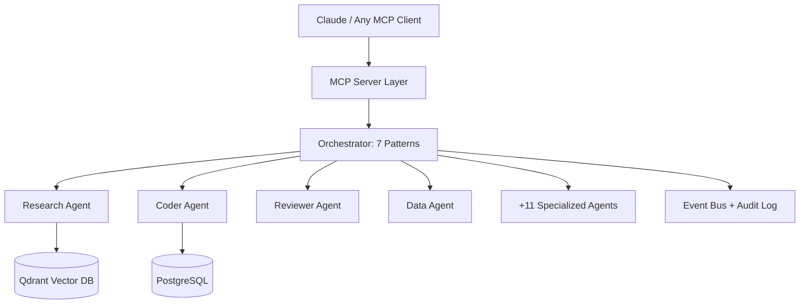

# Enterprise Agent OS — Universal AI Agent Orchestration


> **One OS to run them all.** MCP server + 15 specialized sub-agents + 7 orchestration patterns — the reference implementation for production multi-agent systems.

### Demo

> 🎬 **Demo coming soon** — screen capture will be added at `docs/demo.gif`

### Architecture



**7 Orchestration Patterns:** Sequential · Parallel · Hierarchical · Mesh · Pipeline · Consensus · Adaptive routing

### Quickstart

```bash
git clone https://github.com/bravforcode/enterprise-agent-os.git
cd enterprise-agent-os
cp .env.example .env  # set QDRANT_URL, DATABASE_URL, LLM_API_KEY
docker compose up --build
```

### Results

| Metric | Value |
|---|---|
| Sub-agents | **15** specialized |
| Orchestration patterns | **7** |
| MCP tools exposed | Full tool surface |
| Vector search | Qdrant + hybrid retrieval |


---

**Phirawit Jitnarong — Strategic Full-Stack & AI Engineer**

xme176@gmail.com · 092-551-0427 · [LinkedIn](https://www.linkedin.com/in/%E0%B8%9E%E0%B8%B5%E0%B8%A3%E0%B8%A7%E0%B8%B4%E0%B8%8A%E0%B8%8D%E0%B9%8C-%E0%B8%88%E0%B8%B4%E0%B8%95%E0%B8%93%E0%B8%A3%E0%B8%87%E0%B8%84%E0%B9%8C-0000393a4) · [Fastwork](https://fastwork.co/user/bravforcode?source=search)

> Hiring for this stack? Let's talk — production hardened, 300k+ users shipped.